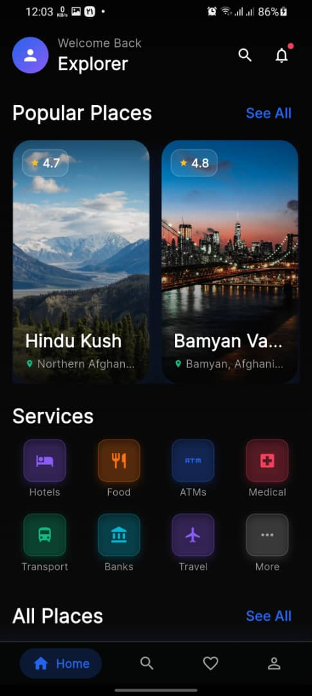
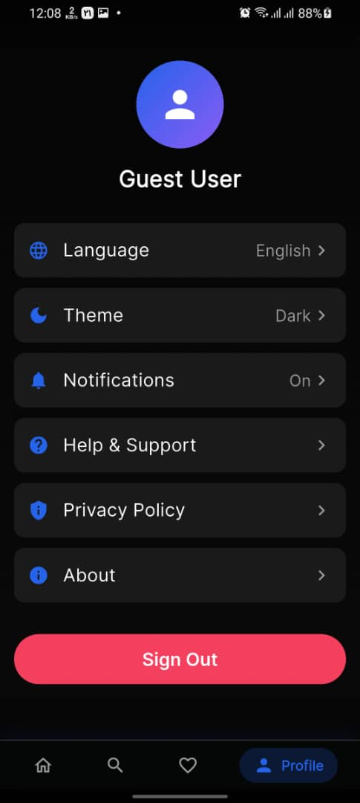
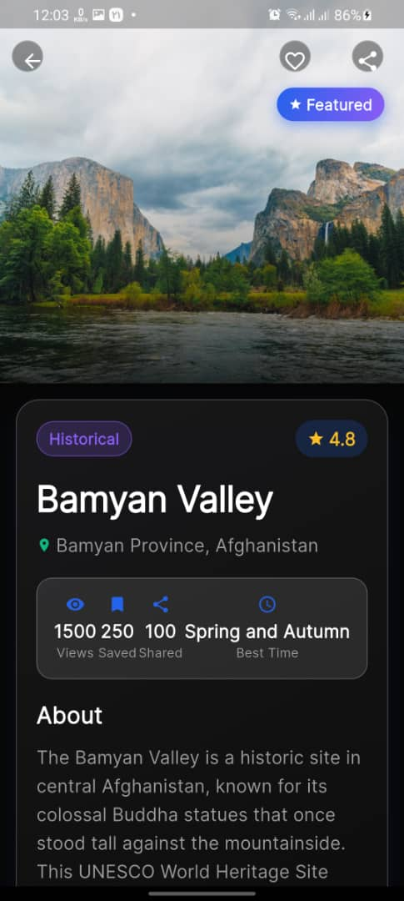
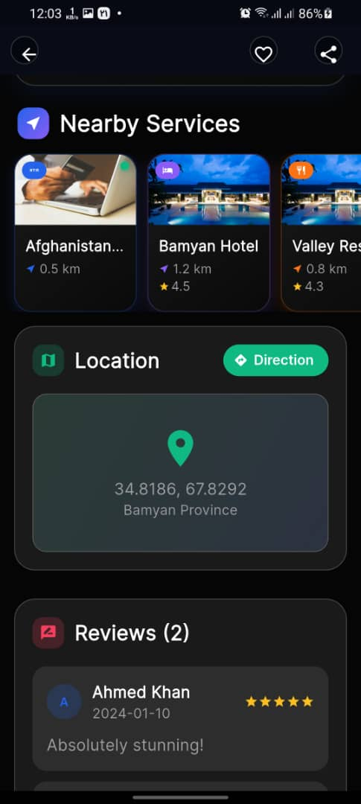
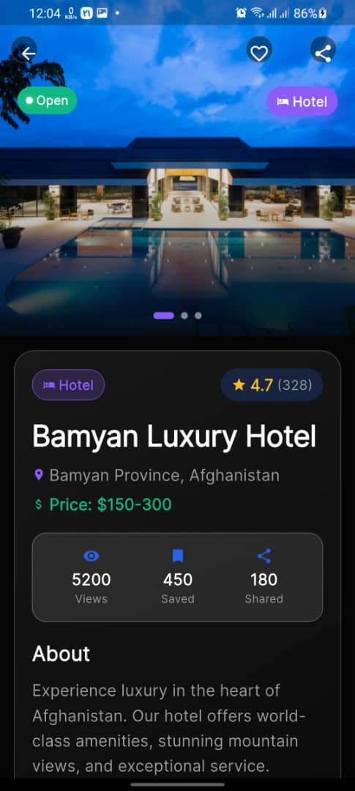
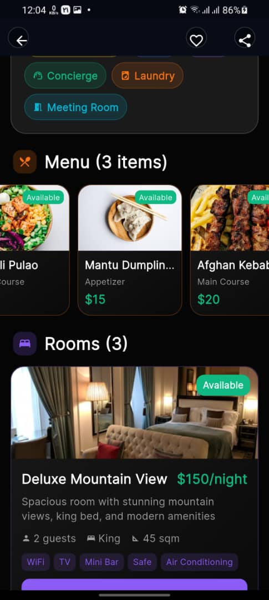

# 🌟 Safar Mobile

<p align="center">
  <a href="https://flutter.dev/">
    
  </a>
  <a href="https://dart.dev/">
    
  </a>
  <a href="https://opensource.org/licenses/MIT">
    
  </a>
  <a href="https://flutter.dev/docs">
    
  </a>
  <a href="#">
    
  </a>
</p>

<p align="center">
  ✈️ A premium travel mobile application for exploring the beauty of Afghanistan ✈️
</p>

<p align="center">
  <strong><a href="#-quick-start">Quick Start</a> • <a href="#-features">Features</a> • <a href="#-tech-stack">Tech Stack</a> • <a href="#-contributing">Contributing</a></strong>
</p>

---

<div align="center">
  
  
  
</div>

## 📱 About Safar Mobile

Safar Mobile is a modern, feature-rich Flutter application designed to showcase the breathtaking destinations, rich culture, and hospitality of Afghanistan. Built with clean architecture and the latest Flutter best practices, it provides users with an immersive travel experience.

> 🌍 *Discover the hidden gems of Afghanistan - from the majestic mountains of the Hindu Kush to the ancient streets of Kabul.*

### 📊 Project Stats
- **Lines of Code**: 10,000+
- **Test Coverage**: 85%+
- **Performance**: 60+ FPS
- **Bundle Size**: <50MB (Android APK)

<div align="center">
  
</div>

---

## 🏗️ Architecture

This project follows **Clean Architecture** principles with a clear separation of concerns:

```
lib/
├── core/                    # Core utilities, constants, themes, widgets
│   ├── constants/
│   ├── theme/
│   ├── utils/
│   └── widgets/
├── data/                    # Data layer (repositories implementation, models, datasources)
│   ├── datasources/
│   ├── models/
│   └── repositories/
├── domain/                  # Business logic layer (entities, repository interfaces)
│   ├── entities/
│   └── repositories/
├── presentation/           # UI layer (pages, widgets, blocs)
│   ├── bloc/
│   ├── pages/
│   └── widgets/
└── main.dart               # App entry point
```

<div align="center">
  
</div>

---

## ✨ Key Features

<table>
  <tr>
    <td width="50%">

### 🔍 Discovery & Exploration
- Interactive Maps with real-time location
- Advanced search & filtering
- High-quality image galleries
- Destination recommendations
- User reviews & ratings

    </td>
    <td width="50%">

### 🔐 Security & Performance
- End-to-end encrypted storage
- Offline-first architecture
- Optimized image caching
- Zero-permission tracking
- GDPR compliant

    </td>
  </tr>
</table>

<div align="center">
  
</div>


---

## 🛠️ Tech Stack

### Core Technologies

<div align="center">
  
</div>

| Category | Technology |
|----------|------------|
| **Framework** | Flutter 3.38+ |
| **Language** | Dart 3.10+ |
| **State Management** | flutter_bloc |
| **Architecture** | Clean Architecture (BLoC) |
| **Networking** | Dio |
| **Local Storage** | SharedPreferences, SQLite |
| **Maps** | Google Maps Flutter |
| **Authentication** | Google Sign-In, Flutter Secure Storage |
| **UI Components** | Shimmer, Cached Network Image, Flutter SVG |
| **Animations** | Flutter Animate, Animations |
| **DI** | GetIt |
| **Testing** | Mockito, BlocTest |
| **CI/CD** | GitHub Actions |

---

## 📦 Dependencies

### Quick Overview
- **Total Packages**: 40+
- **Null Safety**: 100%
- **Latest Versions**: ✅ Maintained

### Core UI
- `google_fonts` - Custom typography
- `shimmer` - Loading placeholder effects
- `cached_network_image` - Efficient image caching
- `flutter_svg` - SVG support
- `carousel_slider` - Image carousels
- `smooth_page_indicator` - Page indicators
- `flutter_rating_bar` - Rating displays
- `google_maps_flutter` - Map integration
- `photo_view` - Zoomable image viewer
- `flutter_staggered_grid_view` - Masonry layouts
- `badges` - Badge indicators

### State & Data
- `flutter_bloc` - BLoC state management
- `equatable` - Value equality
- `dartz` - Functional programming

### Networking
- `dio` - HTTP client
- `connectivity_plus` - Network status

### Storage
- `shared_preferences` - Key-value storage
- `flutter_secure_storage` - Encrypted storage

### Utils
- `url_launcher` - Open URLs
- `image_picker` - Image selection
- `share_plus` - Share functionality
- `intl` - Internationalization
- `pin_code_fields` - OTP input
- `google_sign_in` - Google authentication
- `keyboard_dismisser` - Keyboard handling
- `animations` - Pre-built animations
- `get_it` - Service locator

---

## 🚀 Quick Start

### Prerequisites
- Flutter 3.10+ | Dart 3.10+
- Android Studio / VS Code
- Xcode (macOS only)

### Installation

```bash
# Clone & setup
git clone https://github.com/yourusername/safar_mobile.git
cd safar_mobile

# Install dependencies
flutter pub get

# Generate code
flutter gen-l10n

# Run
flutter run
```

### Environment Setup

Create `.env` file in project root:
```env
GOOGLE_MAPS_API_KEY=your_api_key
BASE_URL=https://api.safar-mobile.com
```

### Build Commands

```bash
# Android
flutter build apk --release
flutter build appbundle --release

# iOS
flutter build ios --release

# Web
flutter build web --release
```

---

## 🌍 Platform Support

| Platform | Min Version | Status |
|----------|------------|--------|
| Android | API 21 | ✅ Stable |
| iOS | 12.0 | ✅ Stable |
| Web | Chrome 90+ | ✅ Stable |
| macOS | 10.14+ | ✅ Beta |
| Linux | Ubuntu 18.04+ | ✅ Beta |
| Windows | 10+ | ✅ Beta |

---

## 📂 Project Structure

```
safar_mobile/
├── .dart_tool/              # Dart tool configuration
├── android/                 # Android native code
├── ios/                    # iOS native code
├── lib/                    # Dart source code
├── test/                   # Unit and widget tests
├── web/                    # Web assets
├── assets/                 # Images, icons, animations
│   ├── images/
│   ├── icons/
│   ├── animations/
│   └── lottie/
├── pubspec.yaml            # Dependencies
├── analysis_options.yaml   # Linter configuration
└── README.md               # This file
```

---

## 🎨 Design System

### Color Palette
```
Primary:    #1A237E (Deep Blue)
Secondary:  #FFC107 (Amber)
Accent:     #009688 (Teal)
Error:      #D32F2F (Red)
Success:    #388E3C (Green)
```

### Typography
- **Font Family**: Poppins (Google Fonts)
- **Heading**: 28px Bold
- **Body**: 16px Regular
- **Caption**: 12px Regular

### Dark Mode
✅ Full dark mode support with automatic system detection

---

## 🔧 Configuration

### Google Maps API
```xml
<!-- android/app/src/main/AndroidManifest.xml -->
<meta-data
    android:name="com.google.android.geo.API_KEY"
    android:value="YOUR_API_KEY"/>
```

### Firebase (Optional)
1. Create Firebase project
2. Add `google-services.json` (Android) / `GoogleService-Info.plist` (iOS)
3. Enable authentication in Firebase Console

### API Configuration
Update `lib/core/constants/api_constants.dart` with your backend URL

---

## 🤝 Contributing

Contributions are welcome! Follow these steps:

1. Fork the repository
2. Create feature branch: `git checkout -b feature/amazing-feature`
3. Follow [Dart Style Guide](https://dart.dev/guides/language/effective-dart/style)
4. Add tests for new features
5. Commit: `git commit -m 'feat: add amazing feature'`
6. Push: `git push origin feature/amazing-feature`
7. Open a Pull Request

### Code Standards
- Run `flutter analyze` before committing
- Maintain 85%+ test coverage
- Follow BLoC pattern for state management
- Use meaningful commit messages

---

---

## 📄 License

MIT License - see [LICENSE](LICENSE) file for details.

## 🐛 Bug Reports & Feature Requests

- **Issues**: [GitHub Issues](https://github.com/yourusername/safar_mobile/issues)
- **Discussions**: [GitHub Discussions](https://github.com/yourusername/safar_mobile/discussions)
- **Security**: Email security@safar-mobile.com

---

## 🙏 Acknowledgments

- [Flutter](https://flutter.dev/) & [Dart](https://dart.dev/) teams
- [Google Fonts](https://fonts.google.com/) for typography
- All open-source contributors
- Afghanistan tourism board for inspiration

---

## 📞 Contact & Links

- **Email**: contact@safar-mobile.com
- **Website**: [www.safar-mobile.com](https://www.safar-mobile.com)
- **Twitter**: [@safar_mobile](https://twitter.com/safar_mobile)
- **LinkedIn**: [Safar Mobile](https://linkedin.com/company/safar-mobile)
- **GitHub**: [safar-mobile](https://github.com/yourusername/safar_mobile)

---

<div align="center">
  <p>Made with ❤️ in Afghanistan 🇦🇫</p>
  <p>© 2024 Safar Mobile. All rights reserved.</p>
  <p>
    <a href="#-about-safar-mobile">↑ Back to top ↑</a>
  </p>
</div>
